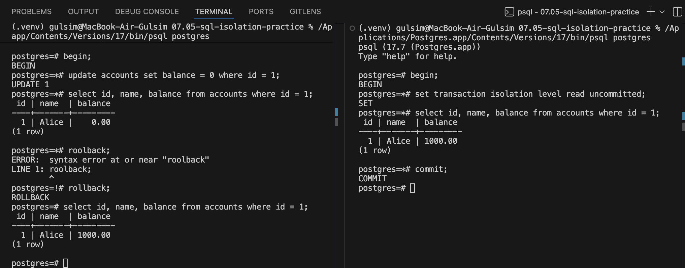
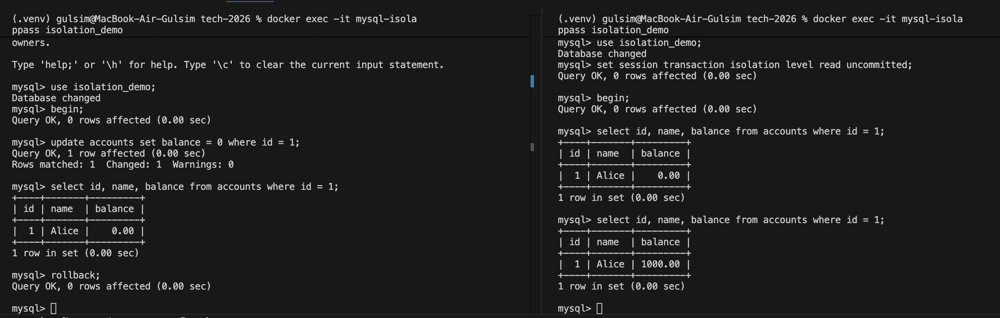
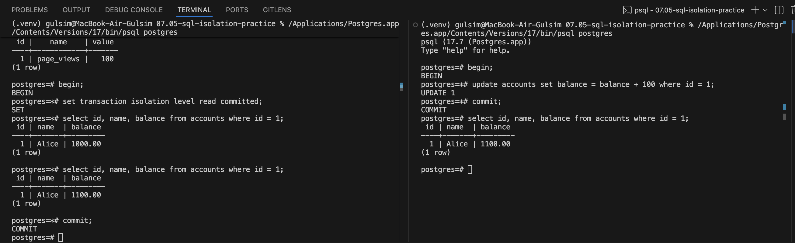
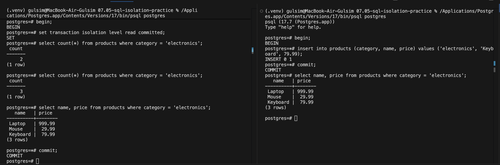
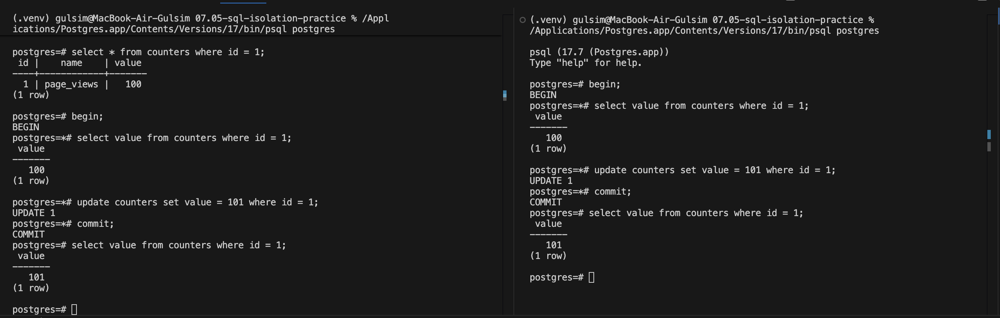

# Отчёт: Аномалии изоляции в SQL

**База данных:** PostgreSQL 17 (Postgres.app)  
**Аномалии:** Dirty Read, Non-Repeatable Read, Phantom Read, Lost Update

---

## Подготовка окружения

Перед каждой демонстрацией запустить сброс данных:

```bash
/Applications/Postgres.app/Contents/Versions/17/bin/psql postgres
```

В psql:
```sql
\i setup.sql
```

Открыть два терминала. В каждом подключиться к PostgreSQL:
```bash
/Applications/Postgres.app/Contents/Versions/17/bin/psql postgres
```

---

## Аномалия 1: Dirty Read (грязное чтение)

### Что такое

Транзакция B читает данные, которые транзакция A изменила, но **ещё не закоммитила**. Если A откатится — B уже использовала "грязные" (невалидные) данные.

### Шаги воспроизведения

| Время | Session A (Terminal 1) | Session B (Terminal 2) |
|-------|------------------------|------------------------|
| t1 | `begin;` | |
| t2 | `update accounts set balance = 0 where id = 1;` | |
| t3 | | `begin;` |
| t4 | | `set transaction isolation level read uncommitted;` |
| t5 | | `select balance from accounts where id = 1;` |
| t6 | `rollback;` | |
| t7 | | `commit;` |

### Результат в PostgreSQL



На шаге t5 Session B **видит `balance = 1000.00`** — оригинальное значение, не грязные данные.

```
-- Session B, шаг t5:
 id | name  | balance
----+-------+---------
  1 | Alice | 1000.00
```

**Важно:** В PostgreSQL dirty read невозможен даже при `READ UNCOMMITTED`. Движок MVCC (Multi-Version Concurrency Control) даёт каждой транзакции snapshot данных на момент начала. READ UNCOMMITTED в PG ведёт себя идентично READ COMMITTED.

---

### Dirty Read в MySQL (воспроизведение аномалии)

В MySQL с `READ UNCOMMITTED` dirty read реально происходит.



| Время | Session A (Terminal 1) | Session B (Terminal 2) |
|-------|------------------------|------------------------|
| t1 | `begin;` | |
| t2 | `update accounts set balance = 0 where id = 1;` | |
| t3 | | `set session transaction isolation level read uncommitted;` |
| t4 | | `begin;` |
| t5 | | `select id, name, balance from accounts where id = 1;` |
| t6 | `rollback;` | |
| t7 | | `select id, name, balance from accounts where id = 1;` |
| t8 | | `commit;` |

```
-- Session B, шаг t5 (Session A ещё не закоммитила!):
 id | name  | balance
----+-------+---------
  1 | Alice |    0.00   ← DIRTY READ: прочитали незакоммиченные данные

-- Session B, шаг t7 (после rollback Session A):
 id | name  | balance
----+-------+---------
  1 | Alice | 1000.00   ← данные на шаге t5 были "грязными"
```

Session B прочитала `balance = 0.00` — данные, которые Session A откатила. Это и есть dirty read: транзакция использовала значение, которое никогда не было зафиксировано в базе.

### Как избежать

PostgreSQL защищает автоматически. В MySQL — использовать уровень изоляции `READ COMMITTED` и выше.

---

## Аномалия 2: Non-Repeatable Read (неповторяемое чтение)

### Что такое

Транзакция A дважды читает **одну и ту же строку** и получает разные значения. Между двумя чтениями транзакция B изменила строку и закоммитила.

### Шаги воспроизведения

| Время | Session A (Terminal 1) | Session B (Terminal 2) |
|-------|------------------------|------------------------|
| t1 | `begin;` | |
| t2 | `set transaction isolation level read committed;` | |
| t3 | `select balance from accounts where id = 1;` → **1000.00** | |
| t4 | | `begin;` |
| t5 | | `update accounts set balance = balance + 100 where id = 1;` |
| t6 | | `commit;` |
| t7 | `select balance from accounts where id = 1;` → **1100.00** | |
| t8 | `commit;` | |

### Результат



```
-- Session A, шаг t3:
 balance
---------
 1000.00

-- Session A, шаг t7 (тот же запрос, та же транзакция!):
 balance
---------
 1100.00    ← АНОМАЛИЯ
```

Один и тот же `select` в одной транзакции вернул разные результаты. Это нарушает логическую целостность транзакции: например, если A вычисляла что-то на основе первого чтения, второе чтение даст противоречие.

### Как избежать

Повысить уровень изоляции до `REPEATABLE READ`:

```sql
set transaction isolation level repeatable read;
```

При `REPEATABLE READ` Session A сделает snapshot в момент первого чтения и будет работать с ним до конца транзакции. Шаг t7 вернёт **1000.00** — изменение Session B невидимо.

---

## Аномалия 3: Phantom Read (фантомное чтение)

### Что такое

Транзакция A дважды выполняет **один и тот же запрос с условием** (например, `count`, `where category = ...`) и получает разное **количество строк**. Между двумя чтениями транзакция B вставила (или удалила) строки, подходящие под условие.

### Шаги воспроизведения

| Время | Session A (Terminal 1) | Session B (Terminal 2) |
|-------|------------------------|------------------------|
| t1 | `begin;` | |
| t2 | `set transaction isolation level read committed;` | |
| t3 | `select count(*) from products where category = 'electronics';` → **2** | |
| t4 | | `begin;` |
| t5 | | `insert into products (category, name, price) values ('electronics', 'Keyboard', 79.99);` |
| t6 | | `commit;` |
| t7 | `select count(*) from products where category = 'electronics';` → **3** | |
| t8 | `commit;` | |

### Результат



```
-- Session A, шаг t3:
 count
-------
     2

-- Session A, шаг t7 (тот же запрос, та же транзакция!):
 count
-------
     3    ← АНОМАЛИЯ: "фантомная" строка появилась

-- Session A, шаг t7 — список строк:
 id |   name    |  price
----+-----------+---------
  1 | Laptop    | 999.99
  2 | Mouse     |  29.99
  5 | Keyboard  |  79.99   ← новая строка (id может отличаться)
```

Транзакция A работала с предположением, что электроники 2 штуки, но в конце обнаружила 3. Это может привести к ошибкам в бизнес-логике (например, неверное распределение скидок по количеству товаров).

### Как избежать

В PostgreSQL `REPEATABLE READ` тоже защищает от phantom read (благодаря MVCC, это отличие от SQL-стандарта).  
Гарантированная защита по стандарту SQL — уровень `SERIALIZABLE`:

```sql
set transaction isolation level serializable;
-- или
set transaction isolation level repeatable read;  -- в PostgreSQL достаточно
```

---

## Аномалия 4: Lost Update (потерянное обновление)

### Что такое

Две транзакции читают одно и то же значение, каждая вычисляет новое на его основе и записывает обратно. Вторая запись перезаписывает первую — **одно обновление теряется**.

Классический пример: два процесса одновременно увеличивают счётчик просмотров. Оба прочитали `100`, оба записали `101`. Итог — `101` вместо `102`.

### Шаги воспроизведения

| Время | Session A (Terminal 1) | Session B (Terminal 2) |
|-------|------------------------|------------------------|
| t1 | `begin;` | |
| t2 | `select value from counters where id = 1;` → **100** | |
| t3 | | `begin;` |
| t4 | | `select value from counters where id = 1;` → **100** |
| t5 | | `update counters set value = 101 where id = 1;` |
| t6 | | `commit;` |
| t7 | `update counters set value = 101 where id = 1;` | |
| t8 | `commit;` | |
| t9 | `select value from counters where id = 1;` → **101** | |

### Результат



```
-- После всех транзакций:
 id |    name    | value
----+------------+-------
  1 | page_views |   101    ← должно быть 102!
```

Оба инкремента выполнились, но счётчик увеличился только на 1. Обновление Session A перезаписало обновление Session B.

### Как избежать

**Способ 1 — атомарное обновление (рекомендуется):**
```sql
update counters set value = value + 1 where id = 1;
```
PostgreSQL применяет обновления последовательно на уровне строки. Конечный результат — 102.

**Способ 2 — пессимистичная блокировка (`SELECT FOR UPDATE`):**
```sql
begin;
select value from counters where id = 1 for update;
-- Session B заблокируется здесь и будет ждать
update counters set value = value + 1 where id = 1;
commit;
```
Session B получит строку только после коммита Session A и прочитает уже обновлённое значение.

**Способ 3 — уровень изоляции `REPEATABLE READ`:**
```sql
set transaction isolation level repeatable read;
```
При конфликте PostgreSQL откатит вторую транзакцию с ошибкой:
`ERROR: could not serialize access due to concurrent update`
Приложение должно повторить транзакцию.

---

## Сводная таблица аномалий

| Аномалия | Уровень, при котором возникает | PostgreSQL | MySQL |
|---|---|---|---|
| Dirty Read | READ UNCOMMITTED | Невозможна (MVCC) | Происходит (продемонстрировано) |
| Non-Repeatable Read | READ COMMITTED | REPEATABLE READ | READ COMMITTED |
| Phantom Read | READ COMMITTED | REPEATABLE READ (в PG) или SERIALIZABLE | SERIALIZABLE |
| Lost Update | READ COMMITTED | Атомарный UPDATE или SELECT FOR UPDATE | Атомарный UPDATE или SELECT FOR UPDATE |

---

## Что скриншотить при защите

### Для каждой аномалии — 3 скриншота:

**Скриншот 1 — начальное состояние:**
- два терминала рядом (split screen)
- запуск `setup.sql`, вывод всех таблиц

**Скриншот 2 — момент аномалии:**
- Terminal 1 (Session A) показывает первый `select` → одно значение
- Terminal 2 (Session B) показывает изменение + `commit`
- Terminal 1 (Session A) показывает второй `select` → другое значение

**Скриншот 3 — итоговое состояние таблицы:**
- `select * from <table>;` в любом терминале

### Что важно видно на скриншотах:
- Промт psql (показывает, что разные сессии): `postgres=#` или с именем БД
- Команды с результатами — полностью, не обрезанные
- Для non-repeatable read: два одинаковых `select` с разными результатами в одной транзакции
- Для phantom read: два одинаковых `count(*)` с разными числами
- Для lost update: финальное значение счётчика `101` вместо `102`
- Для dirty read: что Session B видит **оригинальное** значение (PostgreSQL защищает)

---

## Как читать логи psql

**Начало транзакции:**
```
BEGIN
```

**Успешный UPDATE:**
```
UPDATE 1    ← цифра = количество изменённых строк
```

**Успешный INSERT:**
```
INSERT 0 1  ← 0 это OID (устарело), 1 = количество вставленных строк
```

**Коммит:**
```
COMMIT
```

**Откат:**
```
ROLLBACK
```

**Ошибка (например, при REPEATABLE READ + конфликт):**
```
ERROR:  could not serialize access due to concurrent update
ROLLBACK
```

**Текущий уровень изоляции транзакции:**
```sql
show transaction isolation level;
-- вернёт: read committed / repeatable read / serializable
```

**Посмотреть активные транзакции:**
```sql
select pid, state, query, xact_start
from pg_stat_activity
where state != 'idle';
```
